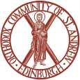

<a id="top"></a>
<p align="center">
  
</p>

<h1 align="center">Edinburgh Orthodox Website</h1>

<p align="center">
  <em>The website of the<br/>Orthodox Community of St Andrew, Edinburgh.</em>
</p>

<p align="center">
  <a href="https://edinburgh-orthodox.github.io/edinburgh-orthodox.org.uk/">🌐 View the site</a>
  &nbsp;·&nbsp;
  <a href="https://edinburgh-orthodox.org.uk" target="_blank">📍 Live domain</a>
  &nbsp;·&nbsp;
  <a href="https://github.com/edinburgh-orthodox/edinburgh-orthodox.org.uk/issues">🕯️ Issue tracker</a>
</p>

<hr/>

## Welcome

☦️ *A parish in the Archdiocese of Thyateira and Great Britain, worshipping in Edinburgh
since 1948.*

The site is a static [Hugo](https://gohugo.io) site in the `edinburgh-orthodox/` folder. A
merge into `main` publishes it: the workflow in `.github/workflows/pages.yml` builds the site
and deploys it to GitHub Pages, and it will serve edinburgh-orthodox.org.uk once the domain is
moved over (issue [#9](https://github.com/edinburgh-orthodox/edinburgh-orthodox.org.uk/issues/9)).

The site it replaces is the WordPress.com site, which is being retired
(issue [#32](https://github.com/edinburgh-orthodox/edinburgh-orthodox.org.uk/issues/32)). New
work goes in this repository, not in the WordPress admin.

The plans for the site live at the repo root: the proposal, the spec, the tickets, and the
visual mockups that set the design.

## Run it locally

You need [Hugo extended](https://gohugo.io/installation/) (the workflows pin version
`0.165.0`).

```sh
hugo server --source edinburgh-orthodox
```

Open http://localhost:1313/. To build the published site:

```sh
hugo --source edinburgh-orthodox --minify
```

The files land in `edinburgh-orthodox/public/`, which is not committed. The pre-commit hook
in `lefthook.yml` runs the same build.

## Where things live

| Folder / file | What it is |
|---------------|------------|
| `edinburgh-orthodox/content/` | The pages, one Markdown file each |
| `edinburgh-orthodox/content/news/` | News posts, newest first on the News page |
| `edinburgh-orthodox/data/` | The weekly services, announcements, churches, wishlist, and FAQ |
| `edinburgh-orthodox/layouts/` | The templates and partials |
| `edinburgh-orthodox/assets/css/` | The SCSS partials, built from the mockups |
| `edinburgh-orthodox/hugo.toml` | Site settings and the navigation menu |
| `proposal.md` | The plan for the site, in plain English |
| `docs/spec-website-redesign.md` | The needs, the decisions, and what is out of scope |
| `CONTEXT.md` | The shared vocabulary (churches, weekly cycle, content tiers) |
| `docs/adr/` | Decisions we have recorded |
| `mockups/` | The visual mockups the design came from, kept for reference |
| `examples/` | Example posts and the church-year calendar file |
| `mockup-changes.md` | Every styling change, compared to the old site |

## Adding news

Add a Markdown file under `edinburgh-orthodox/content/news/`. The filename becomes the URL, so
`parish-feast.md` is published at `/news/parish-feast/`. Set `draft = true` to keep a post out
of the published build. Photographs go alongside the post in a folder of the same name.

## Start here

1. 🌐 **[View the site](https://edinburgh-orthodox.github.io/edinburgh-orthodox.org.uk/)**.
2. 📜 Read [`proposal.md`](proposal.md) for the plan.
3. 🧾 Read [`docs/spec-website-redesign.md`](docs/spec-website-redesign.md) for the detail.
4. 🕯️ Pick up a ticket from the [issue tracker](https://github.com/edinburgh-orthodox/edinburgh-orthodox.org.uk/issues).

<hr/>

<p align="center">
  <sub>Orthodox Community of St Andrew, Edinburgh · Charity SC054378</sub>
</p>
