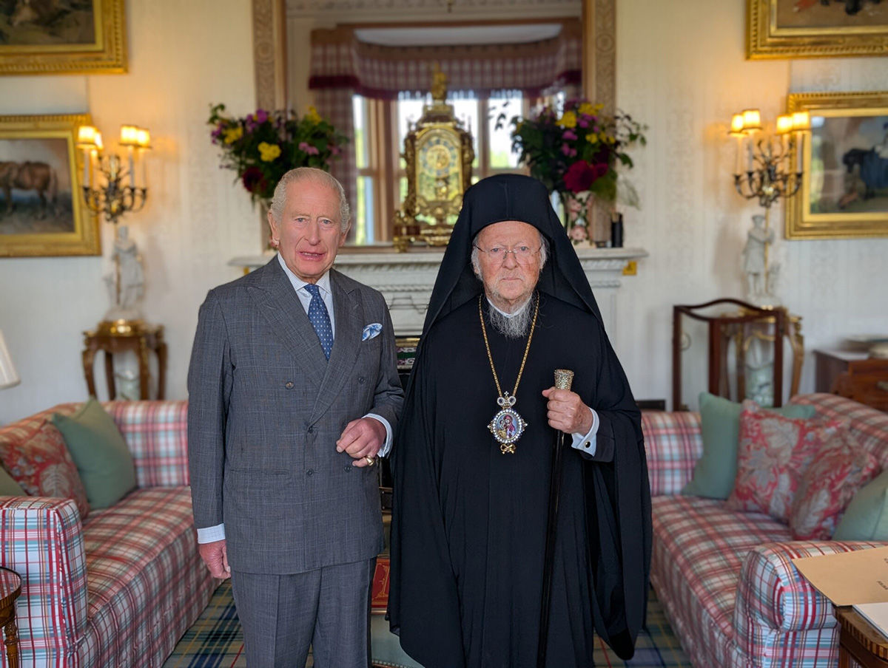
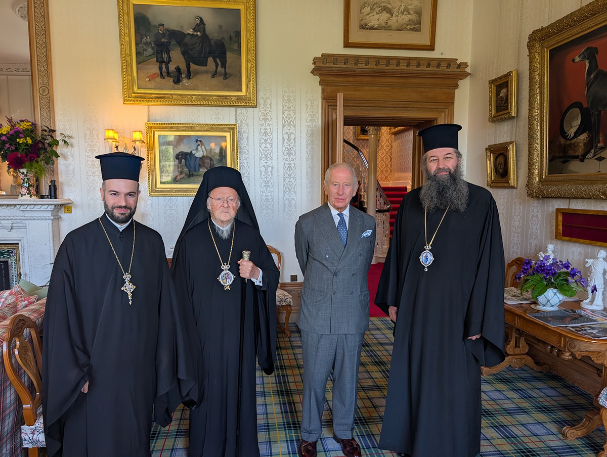

+++
title = "The Ecumenical Patriarch and the King at Balmoral"
date = 2026-09-21
description = "His All-Holiness Ecumenical Patriarch Bartholomew met King Charles III at Balmoral, with Bishop Raphael of Ilion present."
draft = false
+++

On Monday 21 September 2026, His All-Holiness Ecumenical Patriarch Bartholomew met His Majesty King Charles III at Balmoral Castle in Scotland. Our Bishop Raphael of Ilion was with him, together with the Very Reverend Grand Ecclesiarch Aetios, the director of the Patriarchal Private Office.

The King received the Patriarch in private at Balmoral, his own house in the Scottish Highlands. This was the second meeting between the two since the King came to the throne. The first was in October 2022, and they had met before that in London, while the King was still Prince of Wales. A private meeting at Balmoral is not a normal arrangement, and the invitation itself is a sign of friendship.

Half an hour had been set aside for the conversation. It lasted an hour, in what was described as a warm and friendly atmosphere. When it came to an end, the King walked with the Patriarch to the door of the Castle.

*Photographs: the Order of Saint Andrew the Apostle, Archons of the Ecumenical Patriarchate (archons.org).*
